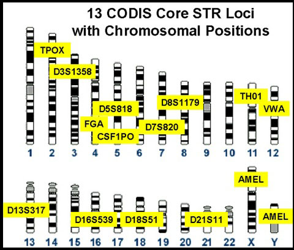

```{r include = FALSE}
knitr::opts_chunk$set(echo = FALSE)
```

\chapter{章节标题 居中}

# 标题一 居中

## 标题二 顶格的1.1

目录到标题二为止。

### 标题三 顶格的1.1.1

#### 标题四 顶格的1.1.1.1

##### 标题五 缩进两格的1.1.1.1.1

`ctexrep`模式下有chapter。标题页后自动分页。

`ctexart`模式下从标题一开始，不能使用`\chapter`。可以用`\newpage`手动分页。

TeX的格式可以参见<http://mirrors.ibiblio.org/CTAN/language/chinese/ctex/ctex.pdf>。

PDF的生成方法为，在R中运行：

```R
rmarkdown::render('20200517rep.Rmd',output_format='all',output_dir='./out')
```

需要R包：`library(rmarkdown)`与`library(rticles)`。
需要安装LaTeX与pandoc。

SNP标记匹配结果如表 1.1。【(ref:tables-Result)引用好像用不了，就直接用顺序编号了。】

```{r tables-Result}
myResult=read.csv('20200517rep.csv', colClasses=c(身份证号='character'))
#myResult=read.csv('20200517rep.csv', colClasses='character')
knitr::kable(myResult, caption = 'SNP标记匹配结果表')
```

```{r eval=FALSE, echo = TRUE}
write.csv(myResult,'t.csv',row.names=F)
tt=read.csv('t.csv', colClasses=c(身份证号='character'))
write.csv(tt,'t2.csv',row.names=F)
```

```csv
$ cat t.csv
"Rank","身份证号","相同标记数","不同标记数","未覆盖标记数","似然比"
1,"888888777777771111",6,11,3,0.95
2,"111111222222223333",7,22,4,0.91
3,"111111444444442222",8,33,5,0.87
4,"13233423",9,44,6,0.83
5,"3242434234",10,55,7,0.79
```

## 配置：

```bash
apt install r-base-core r-cran-tcltk2 pandoc
apt install texlive-latex-recommended texlive-latex-extra
apt install texlive-xetex texlive-lang-chinese
```
可能还需要其他的包。我今天临晨就装了这些。

## 使用

 * 文字部分找人写好，图片“inc/CODIS-and-Chromosome-Loc.jpg”需要更换成57个SNP的。
 * 使用R脚本生成”20200517rep.csv“文件，“20200517rep.Rmd”的内容相对固定，可以考虑直接`printf()`出来。
 * 然后，R脚本执行`rmarkdown::render('20200517rep.Rmd',output_format='all',output_dir='./out')`，就可以生成pdf版与网页版了。

# 前言

本报告由FGI出具。

使用的标记如图 1.1。

```{r, out.width='75%', fig.align='center', fig.cap='STR标记位置图'}

```

\newpage
测试。

write.csv(iris[1:5, ],file='tmp.csv')

```{r eval=FALSE}
write.csv(iris[1:5, ],file='tmp.csv')
xx=read.csv('tmp.csv')
```

\begin{equation}
  E=mc^2
  (\#eq:emc)
\end{equation}

Some text.

(ref:cool-plot) A boxplot of the data `iris` in **base** R.

```{r cool-plot, fig.cap='(ref:cool-plot)'}
boxplot(Sepal.Length ~ Species, data = iris)
```

```{r message = FALSE, warning = FALSE}
library(viridis)
```

The code below demonstrates the Magma palette in the [viridis](https://github.com/sjmgarnier/viridis) package. It displays a contour map of the Maunga Whau volcano in Auckland, New Zealand.

## Magma colors

```{r fig.cap = "The Maunga Whau volcano, Auckland."}
image(volcano, col = viridis(200, option = "A"))
```

HR1

---

HR2

```{r tables-mtcars}
knitr::kable(iris[1:5, ], caption = 'A caption')
```
